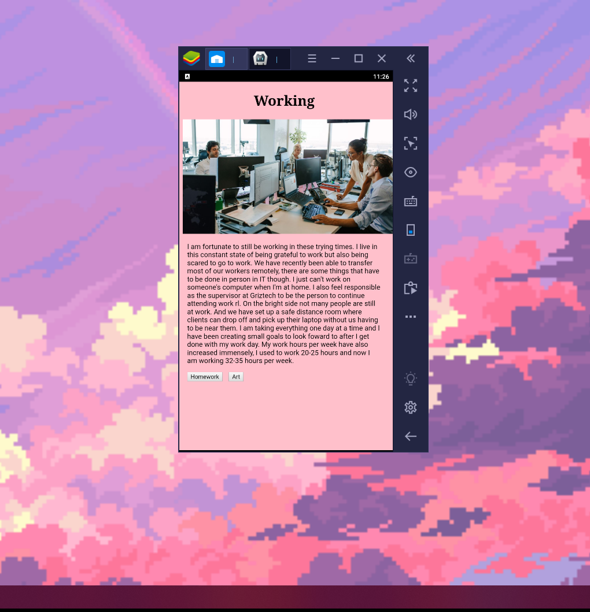

### HW 4

The Cordova-hello-world folder is my APK that I was working on. And although I got an emulator set up on Android Studio with the right API, I couldn't figure out how to actually open the Cordova app. I tried in Android Studio, then I tried in the command prompt and I was getting errors.

So, I thought I would make a last ditch effort and try to open it in BlueStacks and it worked! Not sure, if it's the same but I'm pretty happy.

